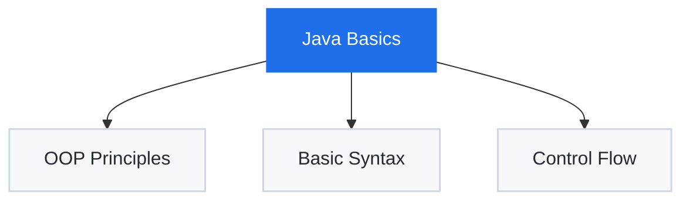

## Topics Covered
- Java Basics
- OOP Principles
- Basic Syntax
- Control Flow

```mermaid
flowchart TB
    JB[Java Basics]

    JB --> OOP[OOP Principles]
    JB --> SYN[Basic Syntax]
    JB --> CF[Control Flow]

    %% Styling for clean blog header look
    classDef main fill:#1f6feb,color:#ffffff,stroke:#1f6feb,stroke-width:2px;
    classDef child fill:#f6f8fa,color:#24292f,stroke:#d0d7de,stroke-width:1.5px;

    class JB main;
    class OOP,SYN,CF child;
```

*Content coming soon... .. .*
